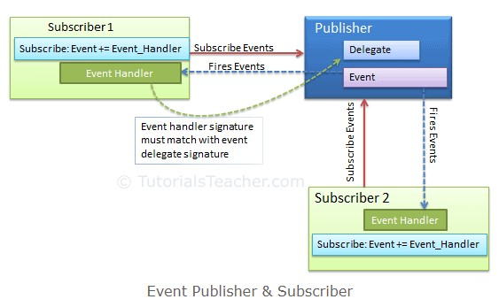
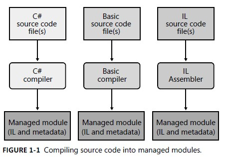
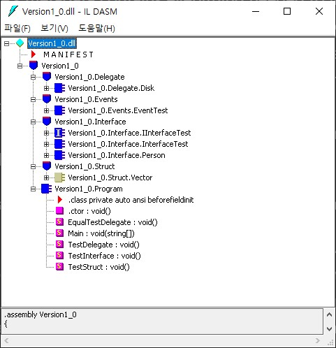
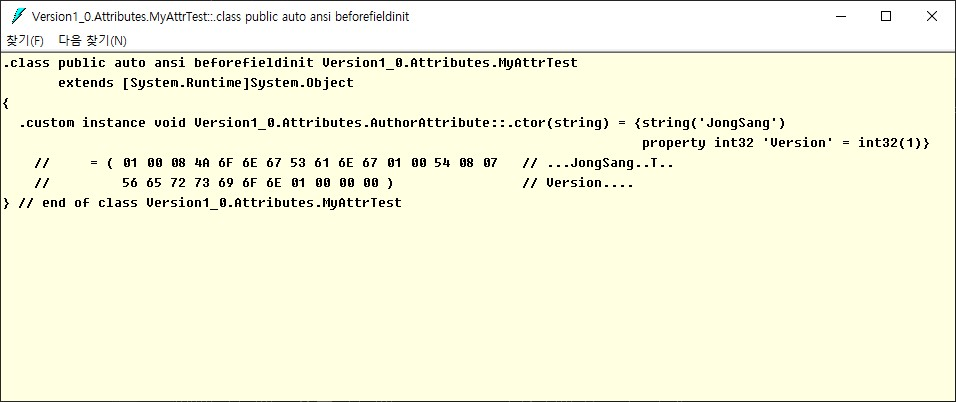
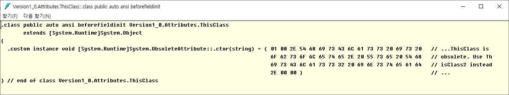
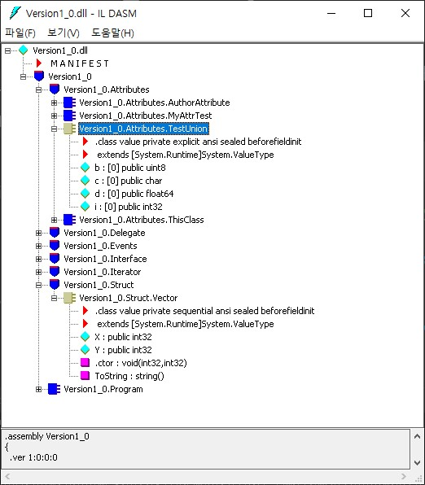

# C# version 1.0
Classes  
Structs  
Interfaces  
Events  
Properties  
Delegates  
Operators and expressions  
Statements  
Attributes  
<br>

# Classes
Refer to [Classes](https://learn.microsoft.com/en-us/dotnet/csharp/fundamentals/types/classes)
<br>
<br>
<br>
<br>

# Structs
- Inherited from ```System.Object```
- value type
- Can be instantiated with ```new``` or without it
- Can not declare the ```default constructor``` explicitly
- Compiler generates the default constructor even there the constructor with parameters exists (vice versa ```class```)
- In constructor with parameters, all fields must be assigned

```c#
   struct Vector
    {
        public int X;
        public int Y;

        public Vector(int x, int y)
        {
            this.X = x;
            this.Y = y;
        }

        public override string ToString()
        {
            return "X: " + this.X + ", Y = " + this.Y;
        }
    }

    class Program
    {
        static void Main(string[] args)
        {
            Vector v1 = new Vector();       // OK
            Vector v2;                      // OK
            Vector v3 = new Vector(5, 10);  // OK

            Console.WriteLine(v1);
            //Console.WriteLine(v2);          // Error, v2 is unassigned

            // The below all is the same
            Vector v4 = new Vector();       // Initialize all member to 0
            Vector v5;
            v5.X = 0;
            v5.Y = 0;
            Vector v6 = new Vector(0, 0);

            // copy value
            Vector v10 = new Vector(20, 30);
            Vector v11 = v10;
            v11.X = -20;
            v11.Y = -30;
            Console.WriteLine("v10 => {0}", v10);
            Console.WriteLine("v11 => {0}", v11);

        }
    }
```
<br>
<br>
<br>
<br>

# Interfaces
Interface is defined as ```Contract```.  
Any ```class``` or ```struct``` that implements that ```contract``` must provide an implementation of the members defined in the interface.

- Can be a member of a namespace or a class
- Can contain declarations (signature without any implementation) of the following members
  - Methods
  - Properties
  - Indexers
  - Events
- Can inherit from one or more base interfaces
  - A class can inherit a base class and also implement one or more interfaces
  - When an interface overrides a method implemented in a base interface, it must use the [explicit interface implementation](https://learn.microsoft.com/en-us/dotnet/csharp/programming-guide/interfaces/explicit-interface-implementation) syntax
- Can't be instantiated directly. Its members are implemented by any class or struct that implements the interface
<br>

References
  - [interface (C# Reference)](https://learn.microsoft.com/en-us/dotnet/csharp/language-reference/keywords/interface)
  - [Interfaces - define behavior for multiple types](https://learn.microsoft.com/en-us/dotnet/csharp/fundamentals/types/interfaces)
<br>
<br>


## Syntax
interface can be defined as the below.
```c#
access_modifier interface interface_name  
{  
    // method declarations  
}  
// access modifier => public or internal(default)
```
<br>
<br>

## Explicit interface implementation
If a class implements ```two interfaces``` that contain a member with ```the same signature```, then implementing that member on the class will cause both interfaces to use that member as their implementation.

```c#
public interface IControl
{
    void Paint();
}
public interface ISurface
{
    void Paint();
}
public class SampleClass : IControl, ISurface
{
    // Both ISurface.Paint and IControl.Paint call this method.
    public void Paint()
    {
        Console.WriteLine("Paint method in SampleClass");
    }
}
...

SampleClass sample = new SampleClass();
IControl control = sample;
ISurface surface = sample;

// The following lines all call the same method.
sample.Paint();
control.Paint();
surface.Paint();

// Output:
// Paint method in SampleClass
// Paint method in SampleClass
// Paint method in SampleClass
```
<br>


### Solution
To call a different implementation depending on which interface is in use, you can ```implement an interface member explicitly```.  
An explicit interface implementation is a class member that is ```only called through the specified interface```.

```c#
public class SampleClass : IControl, ISurface
{
    void IControl.Paint()
    {
        System.Console.WriteLine("IControl.Paint");
    }
    void ISurface.Paint()
    {
        System.Console.WriteLine("ISurface.Paint");
    }
}
...
SampleClass sample = new SampleClass();
IControl control = sample;
ISurface surface = sample;

// The following lines all call the same method.
//sample.Paint(); // Compiler error.
control.Paint();  // Calls IControl.Paint on SampleClass.
surface.Paint();  // Calls ISurface.Paint on SampleClass.

// Output:
// IControl.Paint
// ISurface.Paint
```
- ```An explicit interface``` implementation does ```not have an access modifier``` since it is not accessible as a member of the type it's defined.
- It's only accessible when called through an instance of the interface
<br>

References
- [Explict Interface Implementation(C# Programming Guide), Microsoft](https://learn.microsoft.com/en-us/dotnet/csharp/programming-guide/interfaces/explicit-interface-implementation)
<br>
<br>


## Interface Access Modifiers
Refer to [Interface Access Modifiers](https://www.techpointfunda.com/2020/08/interface-access-modifiers-csharp.html) (including C# 8.0)
<br>
<br>

## Example
```c#
public interface IInterfaceTest
{
    // Default access modifier is public
    void DefaultMethod();
    public void PublicMethod();

    // Provide the default implementation
    public void PublicMethod1()
    {
        PrivateMethod();
    }

    // protected member can be accessed by only derived class
    protected void ProtectedMethod();

    // private member must provide default implementation
    private void PrivateMethod()
    {
        Console.WriteLine("PrivateMethod is called");
    }
}

public class InterfaceTest : IInterfaceTest
{
    public void DefaultMethod()
    {
        Console.WriteLine("DefaultInterface is called");
    }
    public void PublicMethod()
    {
        Console.WriteLine("PublicMethod is called");
    }

    // If this method is commented out, the default method of IInterfaceTest would be called
    void IInterfaceTest.PublicMethod1()
    {
        Console.WriteLine("PublicMethod1 is called");
    }

    void IInterfaceTest.ProtectedMethod()
    {
        Console.WriteLine("ProtectedMethod is called");
    }
}

...
static void TestInterface()
{
    IInterfaceTest iInterfaceTest = new InterfaceTest();
    iInterfaceTest.DefaultMethod();
    iInterfaceTest.PublicMethod();
    iInterfaceTest.PublicMethod1();
    //iInterfaceTest.ProtectedMethod();       // Error

    InterfaceTest interfaceTest = new InterfaceTest();
    interfaceTest.DefaultMethod();
    interfaceTest.PublicMethod();
    //interfaceTest.PublicMethod1();            // Error, can be accessed by only IInterfaceTest type
    //interfaceTest.ProtectedMethod();          // Error
}

// Output
// DefaultInterface is called
// PublicMethod is called
// PublicMethod1 is called
// DefaultInterface is called
// PublicMethod is called
```
<br>
<br>
<br>
<br>

# Delegate
A ```delegate``` is a type that represents references to methods with a particular parameter list and return type.
- Delegates are similar to C++ function pointers, but delegates are fully object-oriented, and unlike C++ pointers to member functions, delegates ```encapsulate both an object instance and a method```.
- Delegates allow methods to be passed as parameters.
- Delegates can be used to define callback methods.
- Delegates can be chained together; for example, multiple methods can be called on a single event.
- Methods don't have to match the delegate type exactly. For more information, see Using Variance in Delegates.

References
- [Delegates(C# Programming Guide)](https://learn.microsoft.com/en-us/dotnet/csharp/programming-guide/delegates/)
<br>
<br>

## Syntax
```delegate``` can be declared as the below.

```c#
access-modifier delegate return-type delegate-name(parameter-list);

// Example
public class Disk
{
    public delegate int FuncDelegate(object arg);
    public int Clean(object arg)
    {
        Console.WriteLine("Working");
        return 0;
    }
}
...

Disk disk = new Disk();
Disk.FuncDelegate cleanFunc = new Disk.FuncDelegate(disk.Clean);
Disk.FuncDelegate cleanFunc2 = disk.Clean; // since C# 2.0

```
<br>

## Multicasting
A ```delegate``` can call more than one method when invoked. This is referred to as ```multicasting```.  

```c#
public class Disk
{
    // Multicasting
    public delegate void CalcDelegate(int x, int y);

    public static void Add(int x, int y) { Console.WriteLine(x + y); }
    public static void Subtract(int x, int y) { Console.WriteLine(x - y); }
    public static void Multiply(int x, int y) { Console.WriteLine(x * y); }
    public static void Divide(int x, int y) { Console.WriteLine(x / y); }
}

static void TestDelegate()
{
    // Multicasting
    Disk.CalcDelegate calc = Disk.Add;
    calc += Disk.Subtract;
    calc += Disk.Multiply;
    calc += Disk.Divide;

    calc(10, 5);
}

// output
// 15
// 5
// 50
// 2
```

Acutually, the preceding "```+```" expression regarding ```delegate``` is converted into the below by the compiler.
<br>

```c#
 // Multicasting
var calc = new Disk.CalcDelegate(Disk.Add);
var calcSub= new Disk.CalcDelegate(Disk.Subtract);
var calcMul = new Disk.CalcDelegate(Disk.Multiply);
var calcDiv = new Disk.CalcDelegate(Disk.Divide);

calc = Disk.CalcDelegate.Combine(calc, calcSub) as Disk.CalcDelegate;
calc = Disk.CalcDelegate.Combine(calc, calcMul) as Disk.CalcDelegate;
calc = Disk.CalcDelegate.Combine(calc, calcDiv) as Disk.CalcDelegate;

calc(10, 5);
```
References
- 시작하세요! C# 9.0 프로그래밍, 정성태
<br>
<br>
<br>

# Events
```Events``` are, like delegates, a *```late binding```* mechanism. 
In fact, events are built on the language support for delegates.
- Events are a way for an object to broadcast that something has happened.
- Subscribing to an event also ```creates a coupling``` between two objects (the event source, and the event sink). You need to ensure that the event sink unsubscribes from the event source when no longer interested in events.
<br>

<p align="center">

</p>

References
- [Introduction to events, Microsoft](https://learn.microsoft.com/en-us/dotnet/csharp/events-overview)
- [event (C# reference), Microsoft](https://learn.microsoft.com/en-us/dotnet/csharp/language-reference/keywords/event)
- [C# - Events, TutorialsTeacher](https://www.tutorialsteacher.com/csharp/csharp-event)

<br>
<br>

## Design goals for event support
- Enable ```very minimal coupling``` between an event source and an event sink. These two components may not be written by the same organization, and may even be updated on totally different schedules.
- It should be very simple to subscribe to an event, and to unsubscribe from that same event.
- Event sources should support multiple event subscribers. It should also support having no event subscribers attached.
<br>
<br>

## Syntax
The event can be declared as the below.

```c#
class class_name
{
    access_modifier event delegate_type identifier;
}
```
<br>
<br>

## Event example
Refer to [C# - Events, TutorialsTeacher](https://www.tutorialsteacher.com/csharp/csharp-event)
<br>
<br>

## Event VS Delegate
- What is the role of ```event``` keyword?
    - Instanticates the instance by itself unlike ```delegate```
    - Provides the functionality of adding and removing callback methods easily
    <br>
    <br>

    ### Example code for understanding ```event``` keyword comparing to ```delegate```
    ```c#
    // =========== Using Delegater ============
    class PrimeGenerator
    {
        // Declare delegate type for callback
        public delegate void PrimeDelegate(object sender, EventArgs args);

        // Declare delegate instance for callback methods
        PrimeDelegate callbacks;

        // Add callback method
        public void AddDelegate(PrimeDelegate callback)
        {
            callbacks += callback;
        }

        // Remove callback method
        public void RemoveDelegate(PrimeDelegate callback)
        {
            callbacks -= callback;
        }

        ...
    }
    ...

    class Program
    {
        static void PrintPrime(object sender, EventArgs args)
        {
            // Print prime
        }

        static void SumPrime(object sender, EventArgs args)
        {
            // Sum prime 
        }

        static void Main(string[] args)
        {
            PrimeGenerator gen = new PrimeGenerator();

            PrimeGenerator.PrimeDelegate callprint = PrintPrime;
            gen.AddDelegate(PrintPrime);

            PrimeGenerator.PrimeDelegate callsum = SumPrime;
            gen.AddDelegate(SumPrime);
            
            ...
        }
    }

    // =========== Using event keyword ===========
    class PrimeGenerator
    {
        public event EventHandler PrimeGenerated;
    }

    class Program
    {
        static void PrintPrime(object sender, EventArgs args)
        {
            // Print prime
        }

        static void SumPrime(object sender, EventArgs args)
        {
            // Sum prime 
        }

        static void Main(string[] args)
        {
            PrimeGenerator gen = new PrimeGenerator();

            gen.PrimeGenerator += PrintPrime;
            gen.PrimeGenerator += SumPrime;

            ...

        }
    }

    ```

- What does ```EventHandler``` type mean?
    - Specific type of ```delegate```
    References
    - [EventHandler Delegate, Microsoft](https://learn.microsoft.com/en-us/dotnet/api/system.eventhandler?view=net-7.0)
<br>
<br>

    ### Declaration of EventHandler
    ```c#
    namespace System
    {
        //
        // Summary:
        //     Represents the method that will handle an event that has no event data.
        //
        // Parameters:
        //   sender:
        //     The source of the event.
        //
        //   e:
        //     An object that contains no event data.
        public delegate void EventHandler(object? sender, EventArgs e);
    }
    ```
<br>
<br>
<br>


# Metadata
## Background
- In the past, a software component (.exe or .dll) that was written in one language ```could not easily use a software component``` that was written in another language.  
- ```.NET``` makes component interoperation even easier by allowing compilers to emit ```additional declarative information``` into all modules and assemblies. This information, called ```metadata```, helps components to interact seamlessly.
<br>
<br>

## Definition
Metadata is ```binary information describing your program``` that is stored either in a common language runtime portable executable (PE) file or in memory. 
1. You compile your code into a PE(Portable Executable) file
2. Metadata is inserted into one portion of the file
3. Your code is converted to ```MSIL(Microsoft Intermediate Language)``` and inserted into another portion of the file
4. Every type and memeber that is defined and referenced in a module or assembly is described within metadata
5. When code is executed, the runttime loads metadata into memory and references it to discover information about your code's classes, members, inheritance, and so on
<br>
<br>

<figure align="left">
    
    <figcaption align="left">
        <b>Compiling source code into managed modules (from "CLR via C#")</b>
    </figcaption>
</figure>
<br>
<br>

## Benefits of Metadata
- Self-describing files
- LanguageLanguage interoperability and easier component-based design 
- Attributes
<br>
<br>

## Type's fields and methods of your code by IL Disassembler tool
When the compiler compiles this code, the result is a type that has a number of fields and methods defined in it.  
You can easily see this by using the IL Disassembler tool (ILDasm.exe) provided with the .NET Framework SDK to examine the resulting managed module.

<figure align="left">
    
    <figcaption align="left">
        <b>ILDasm showing the fields and methods (obtained from metadata)</b>
    </figcaption>
</figure>


## References
- [Metadata and Self-Describing Components, Microsoft](https://learn.microsoft.com/en-us/dotnet/standard/metadata-and-self-describing-components)
- CLR via C# 4th edition, Jeffrey Richter
<br>
<br>
<br>


# Attributes
- Attributes provide a powerful method of associating `metadata`, or declarative information, with code  
  - assemblies, types, methods, properties, and so forth
- After an attribute is associated with a program entity, the attribute can be queried at ```run-time``` by using a technique called ```reflection```.
<br>
<br>

## Properties of attributes
1. Add ```metadata``` to your program
   1. You can add custom attributes to specify any ```additional information```.
2. ```One or more attributes``` can be applied to entire assemblies, modules, or smaller program elements such as classes and properties
3. Can accept ```arguments``` in the same way as methods and properties
4. Can examine its own metadata or the metadata in other programs by using ```reflection```.

<br>
<br>

## Example code1

```c#
public class AuthorAttribute : System.Attribute
{
    string name;
    int version;

    public int Version
    {
        get { return version; }
        set { version = value; }
    }

    public AuthorAttribute(string name)
    {
        this.name = name;
    }
}

[Author("JongSang", Version = 1)]
public class MyAttrTest
{
    string testString;
    public MyAttrTest(string str)
    {
        testString = str;
    }

    public void Print()
    {
        Console.WriteLine(testString);
    }
}
...
static void TestAttribute()
{
    Console.WriteLine("\n==== Test Attributes ====");
    var myAttrTest = new MyAttrTest("Test");
}
```
<br>

- Metadata information (from ILDasm)

<figure align="left">
    
    <figcaption align="left">
    </figcaption>
</figure>

> [!NOTE]  
> By convention, all attribute names end with the word "Attribute" to distinguish them from other items in the .NET libraries.  
> However, you do not need to specify the attribute suffix when using attributes in code. For example, `[DllImport]` is equivalent to `[DllImportAttribute]`, but `DllImportAttribute` is the attribute's actual name in the .NET Class Library.

<br>

## Example code2
```csharp
[Obsolete("ThisClass is obsolete. Use ThisClass2 instead.")]
public class ThisClass
{
    // ...
}
...
static void TestAttribute()
{
    var thisClass = new ThisClass();
}
```
It shows the compile warnings.
<br>

- Intellisense warning
<figure align="left">
    
    <figcaption align="left">
    </figcaption>
</figure>

<br>

- Build output warning
<figure align="left">
    
    <figcaption align="left">
    </figcaption>
</figure>

- Metadata information (from ILDasm)
<figure align="left">
    
    <figcaption align="left">
    </figcaption>
</figure>

<br>
<br>

## Example code3
By using attributes, you can customize how structs are laid out in memory.  
For example, you can create what is known as a union in C/C++ by using the StructLayout(LayoutKind.Explicit) and FieldOffset attributes.  
All of the fields of TestUnion start at the same location in memory.
```c#
[System.Runtime.InteropServices.StructLayout(LayoutKind.Explicit)]
struct TestUnion
{
    [System.Runtime.InteropServices.FieldOffset(0)]
    public int i;

    [System.Runtime.InteropServices.FieldOffset(0)]
    public double d;

    [System.Runtime.InteropServices.FieldOffset(0)]
    public char c;

    [System.Runtime.InteropServices.FieldOffset(0)]
    public byte b;
}
```
- Metadata information (from ILDasm)
<figure align="left">
    
    <figcaption align="left">
    </figcaption>
</figure>


<br>
<br>

## Atribute targets
The list of possible `target` values is shown in the following table.

Target value|Applies to|
|------------------|----------------|
|`assembly`|Entire assembly|
|`module`|Current assembly module|
|`field`|Field in a class or a struct|
|`event`|Event|
|`method`|Method or `get` and `set` property accessors|
|`param`|Method parameters or `set` property accessor parameters|
|`property`|Property|
|`return`|Return value of a method, property indexer, or `get` property accessor|
|`type`|Struct, class, interface, enum, or delegate|
<br>

```csharp
[AttributeUsage(AttributeTargets.Class | AttributeTargets.Method)]
class AuthorAttribute : System.Attribute
{
    //
}
```


Refer to [Attributes (C#), Microsoft](https://learn.microsoft.com/en-us/dotnet/csharp/programming-guide/concepts/attributes/)
<br>
<br>


References
- [How to create a C/C++ union by using attributes(C#)](https://learn.microsoft.com/en-us/dotnet/csharp/programming-guide/concepts/attributes/how-to-create-a-c-cpp-union-by-using-attributes)
- [DllImport Attribute, techopedia](https://www.techopedia.com/definition/25611/dllimport-attribute)


