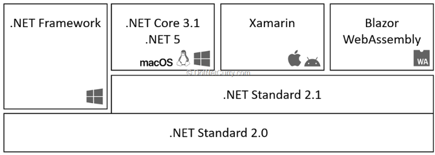

# .NET Standard

Reference : [.NET Standard](https://learn.microsoft.com/en-us/dotnet/standard/net-standard?tabs=net-standard-1-0)

- .NET Standard is a `formal specification of .NET APIs that are available on multiple .NET implementations`. 
- The motivation behind .NET Standard was to establish `greater uniformity` in the .NET ecosystem. 
- .NET 5 and later versions adopt a different approach to establishing uniformity that `eliminates the need for .NET Standard` in most scenarios. 
- However, if you want to `share code between .NET Framework and any other .NET implementation`, such as .NET Core, your library should target `.NET Standard 2.0`. 
- `No new versions of .NET Standard will be released`, but .NET 5, .NET 6, and all future versions will `continue to support` .NET Standard 2.1 and earlier.

For information about choosing between .NET 5+ and .NET Standard, see .NET 5+ and .NET Standard later in this article.

 
 

# .NET Standard versions
- .NET Standard is versioned. 
- Each new version adds more APIs. 
- When a library is built against a certain version of .NET Standard, it can run on any .NET implementation that implements that version of .NET Standard (or higher).
 
 
 

- `Targeting a higher version` of .NET Standard allows a library to use more APIs but means it can only be used on more recent versions of .NET. 
- `Targeting a lower version` reduces the available APIs but means the library can run in more places.

 
 

# Appendix

## .Net Standard 
<figure align="left">
    
    <figcaption align="left">
    </figcaption>
</figure>

Ref : [.NET Runtime](https://www.dotnetcurry.com/dotnetcore/dotnet-5-features-download)

