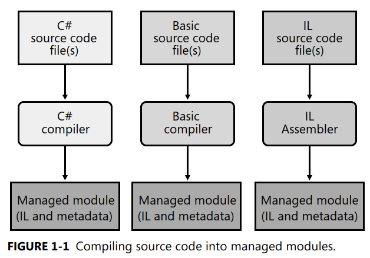
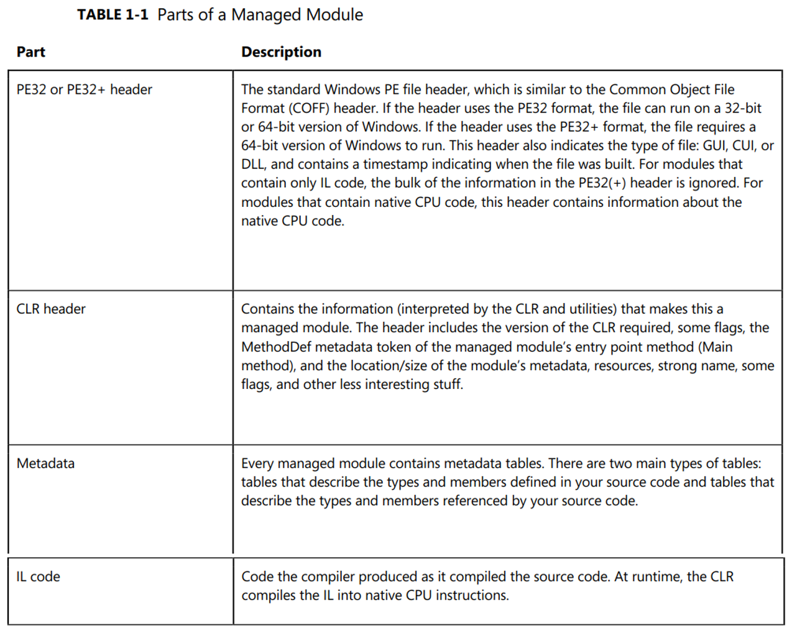
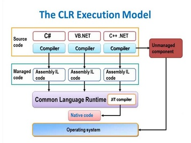
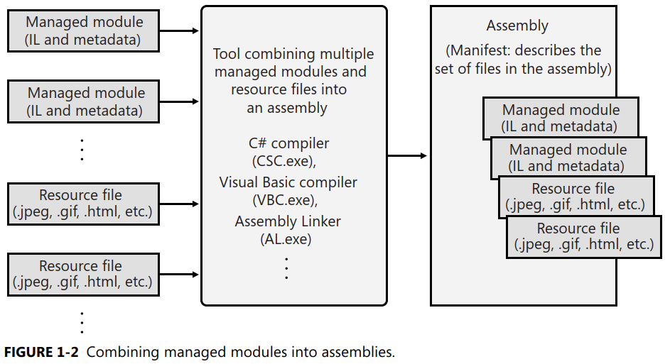
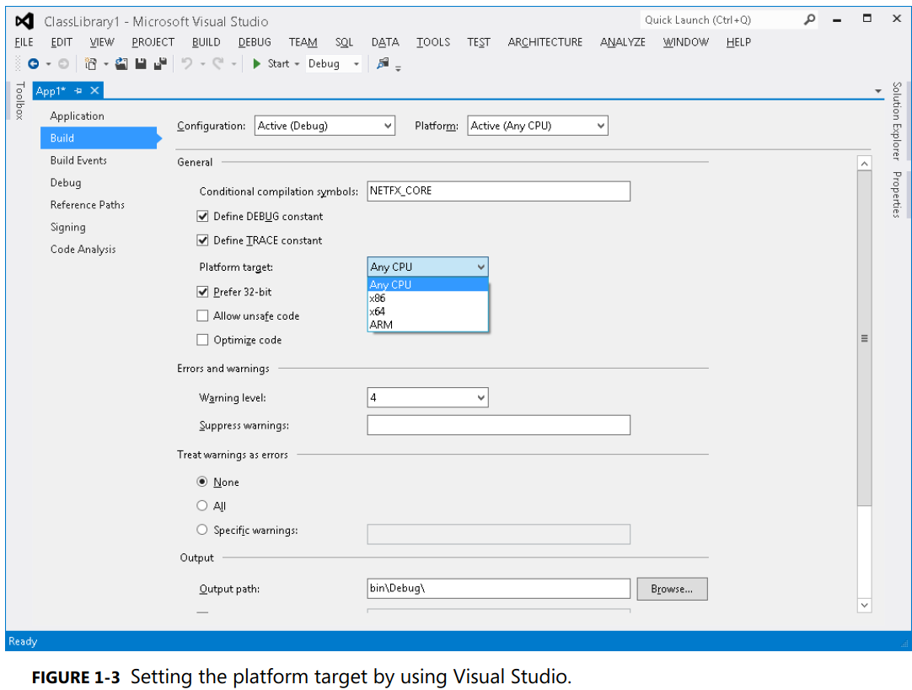
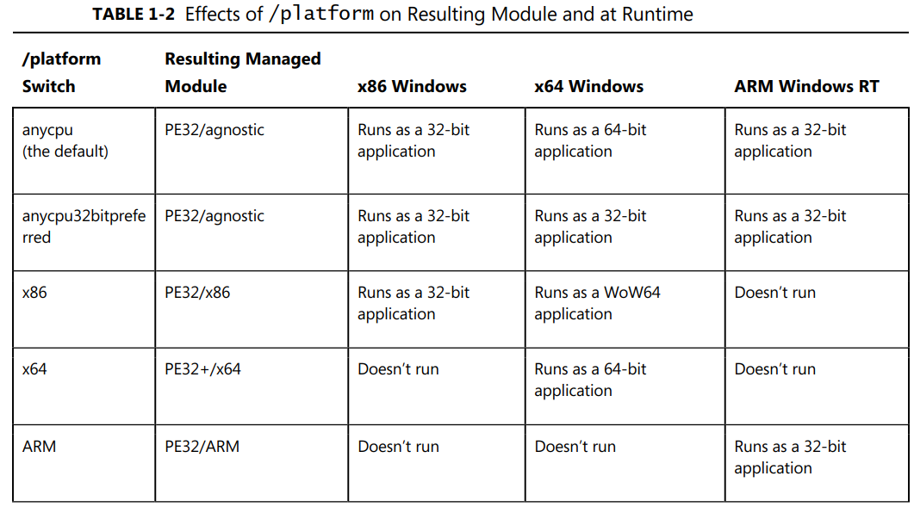
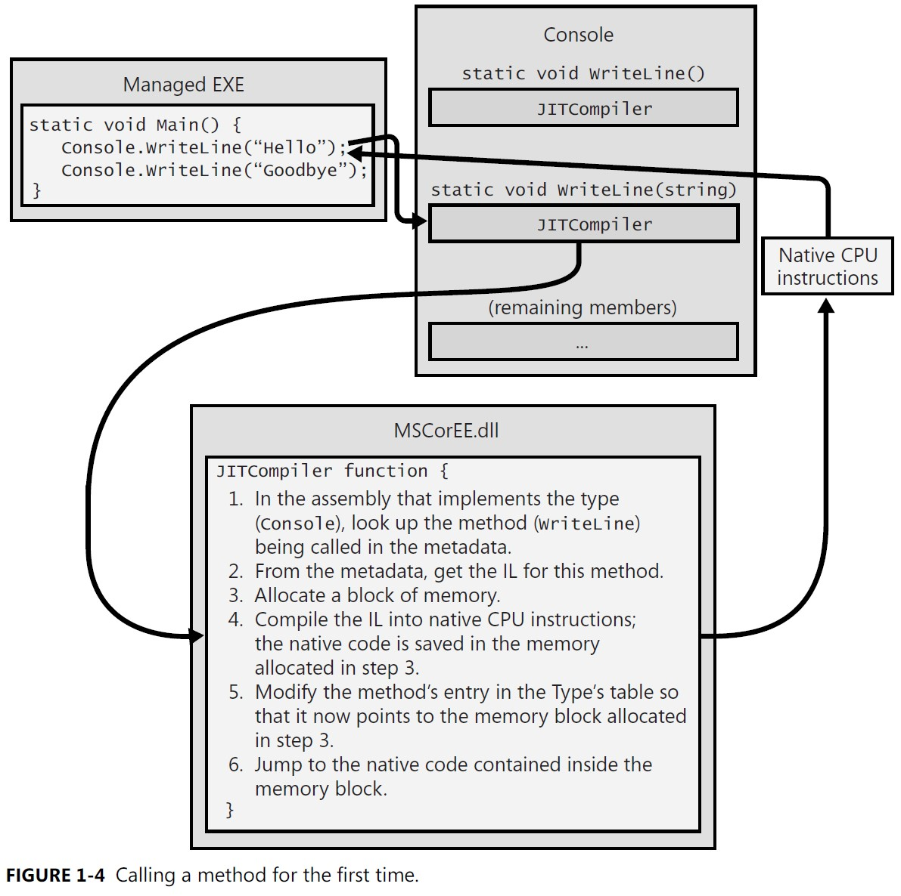
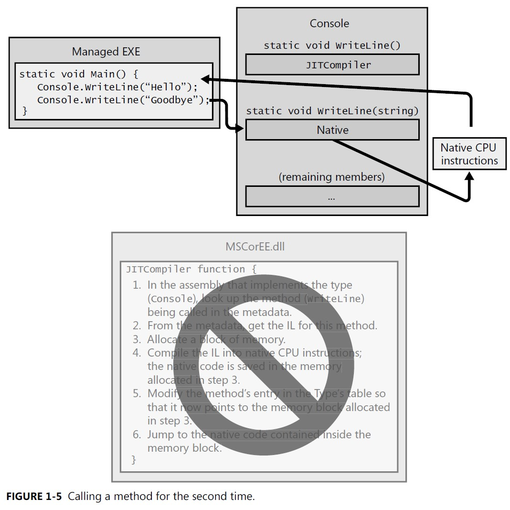

# Execution model
All text and almost figures in this file are from the book, "CLR via C#"  
<br>


# Compiling Source Code into Managed Modules

## Ready to start development
You’ve decided to use the .NET Framework as your development platform.  
Great! Your first step is to determine what type of application or component you intend to build. Let’s just assume that you’ve completed this minor detail; everything is designed, the specifications are written, and you’re ready to start development.  
<br>

## Decide programming language

This task is usually difficult because different languages offer different capabilities.  
For example,,,  

### Unmanaged C/C++  
- you have pretty low-level control of the system.  
- You can manage memory exactly the way you want to, create threads easily if you need to, and so on.  

### Microsoft Visual Basic 6
- allows you to build UI applications very rapidly
- makes it easy for you to control COM objects and databases.  
<br>


## CLR - Common Language Runtime
The `common language runtime (CLR)`:w
 is just what its name says it is:  
- Runtime that is usable by different and varied programming languages.  
- The core features of the CLR (such as memory management, assembly loading, security, exception handling, and thread synchronization) are `available to any and all programming languages that target it`. 
- For example,, 
  - The runtime uses `exceptions to report errors`, so all languages that target the runtime also get errors reported via exceptions. 
  - The runtime also allows you to `create a thread`, so any language that targets the runtime can create a thread. 


In fact, at runtime, the CLR has no idea which programming language the developer used for the source code. This means that you should choose whatever programming language allows you to express your intentions most easily. `You can develop your code in any programming language you desire as long as the compiler you use to compile your code targets the CLR.`  
<br>


### The benefits of using one programming language over another
Well, I think of compilers as syntax checkers and “correct code” analyzers. They examine your source code, ensure that whatever you’ve written makes some sense, and then output code that describes your intention. Different programming languages allow you to develop using different syntax. Don’t underestimate the value of this choice. For mathematical or financial applications, expressing your intentions by using APL syntax can save many days of development time when compared to expressing the same intention by using Perl syntax, for example.  
Microsoft has created several language compilers that target the runtime: 
- C++/CLI
- C# (pronounced “C sharp”)
- Visual Basic
- F# (pronounced “F sharp”)
- Iron Python
- Iron Ruby
- Intermediate Language (IL) Assembler.  

In addition to Microsoft, several other companies, colleges, and universities have created compilers that produce code to target the CLR. I’m aware of compilers for Ada, APL, Caml, COBOL, Eiffel, Forth, Fortran, Haskell, Lexico, LISP, LOGO, Lua, Mercury, ML, Mondrian, Oberon, Pascal, Perl, PHP, Prolog, RPG, Scheme, Smalltalk, and Tcl/Tk.  
<br>

<figure align="left">
    
    <figcaption align="left">
    </figcaption>
</figure>

Figure 1-1 shows the process of compiling source code files. As the figure shows, you can create 
source code files written in any programming language that supports the CLR. Then you use the corresponding compiler to check the syntax and analyze the source code. `Regardless of which compiler you use, the result is a managed module`. A managed module is a standard 32-bit Microsoft Windows portable executable (PE32) file or a standard 64-bit Windows portable executable (PE32+) file that requires the CLR to execute. By the way, managed assemblies always take advantage of Data Execution Prevention (DEP) and Address Space Layout Randomization (ASLR) in Windows; these two features improve the security of your whole system.  
<br>

<figure align="left">
    
    <figcaption align="left">
    </figcaption>
</figure>

<br>

## Managed code
Native code compilers produce code targeted to a specific CPU architecture, such as x86, x64, or ARM. `All CLR-compliant compilers produce IL code instead`. (I’ll go into more detail about IL code later in this chapter.) IL code is sometimes referred to as `managed code because the CLR manages its execution`. 

In addition to emitting IL, every compiler targeting the CLR is required to emit full metadata into every managed module.  
In brief, metadata is a set of data tables that describe 
- what is defined in the module, such as types and their members. 
- what the managed module references, such as imported types and their members.  

Metadata is a superset of older technologies such as COM’s Type Libraries and Interface Definition Language (IDL) files. 
The important thing to note is that CLR metadata is far more complete. And, unlike Type Libraries and IDL, metadata is always associated with the file that contains the IL code.  
In fact, `the metadata is always embedded in the same EXE/DLL as the code, making it impossible to separate the two`. Because the `compiler produces the metadata and the code at the same time and binds them into the resulting managed module`, the metadata and the IL code it describes are never out of sync with one another. 
Metadata has many uses. Here are some of them: 

• Metadata `removes the need for native C/C++ header and library files` when compiling because 
all the information about the referenced types/members is contained in the file that has the IL 
that implements the type/members. Compilers can read metadata directly from managed 
modules. 

• Microsoft Visual Studio uses metadata to help you write code. Its `IntelliSense feature parses metadata` to tell you what methods, properties, events, and fields a type offers, and in the case of a method, what parameters the method expects. 

• The CLR’s code `verification process uses metadata` to ensure that your code performs only “type-safe” operations. (I’ll discuss verification shortly.) 

• Metadata allows an `object’s fields to be serialized` into a memory block, sent to another machine, and then deserialized, re-creating the object’s state on the remote machine. 

• Metadata allows the `garbage collector to track the lifetime of objects`. For any object, the garbage collector can determine the type of the object and, from the metadata, know which 
fields within that object refer to other objects. In Chapter 2, “Building, Packaging, Deploying, and Administering Applications and Types,” I’ll describe metadata in much more detail. 
Microsoft’s C#, Visual Basic, F#, and the IL Assembler always produce modules that contain managed code (IL) and managed data (garbage-collected data types). End users must have the CLR 
(presently shipping as part of the .NET Framework) installed on their machine in order to execute any modules that contain managed code and/or managed data in the same way that they must have the Microsoft Foundation Class (MFC) library or Visual Basic DLLs installed to run MFC or Visual Basic 6 applications.  

<br>

By default, Microsoft’s C++ compiler builds EXE/DLL modules that contain unmanaged (native) code and manipulate unmanaged data (native memory) at runtime. These modules don’t require the 
CLR to execute.  
However, `by specifying the /CLR command-line switch, the C++ compiler produces modules that contain managed code, and of course, the CLR must then be installed to execute this code`. Of all of the Microsoft compilers mentioned, C++ is unique in that it is the only compiler that allows the developer to write both managed and unmanaged code and have it emitted into a single module. It is also the only Microsoft compiler that allows developers to define both managed and unmanaged data types in their source code. The flexibility provided by Microsoft’s C++ compiler is unparalleled by other compilers because it allows developers to use their existing native C/C++ code from managed code and to start integrating the use of managed types as they see fit. 

<figure align="left">
    
    <figcaption align="left">
    </figcaption>
</figure>

<br>
<br>
<br>

# Combining Managed Modules into Assemblies
The CLR doesn’t actually work with modules, `it works with assemblies`.  
An assembly is an abstract concept that can be difficult to grasp initially. 
- First, an assembly is a `logical grouping of one or more modules or resource files`. 
- Second, an assembly is the smallest unit of reuse, security, and versioning. Depending on the choices you make with your compilers or tools, you can produce a single-file or a multifile assembly.  

`In the CLR world, an assembly is what we would call a component`.  

Figure 1-2 should help explain what assemblies are about.  
In this figure,,  
- some managed modules and resource (or data) files are being processed by a tool. 
- This tool produces a single PE32(+) file that represents the logical grouping of files. 
- What happens is that this PE32(+) file contains a block of data called the manifest. 
  > The manifest is simply `another set of metadata tables`. These tables describe the files that make up the assembly, the publicly exported types implemented by the files in the assembly, and the resource or data files that are associated with the assembly. 


<figure align="left">
    
    <figcaption align="left">
    </figcaption>
</figure>


`By default, compilers actually do the work of turning the emitted managed module into an assembly`; 
- the C# compiler emits a managed module that contains a manifest. 
- The manifest indicates that the assembly consists of just the one file. 
  > So, for projects that have just one managed module and no resource (or data) files, the assembly will be the managed module, and you don’t have any additional steps to perform during your build process. `If you want to group a set of files into an assembly, you’ll have to be aware of more tools (such as the assembly linker, AL.exe)` and their command-line options.  

An assembly allows you to decouple the logical and physical notions of a reusable, securable, versionable component. How you partition your code and resources into different files is completely up to you.  
For example,,, 
- you could put rarely used types or resources in separate files that are part of an assembly. 
- The separate files could be downloaded on demand from the Web as they are needed at runtime. 
- If the files are never needed, they’re never downloaded, saving disk space and reducing installation time. 
- Assemblies allow you to break up the deployment of the files while still treating all of the files as a single collection. 
- An assembly’s modules also include information about referenced assemblies (including their version numbers). 
  > This information makes an assembly self-describing. In other words, the CLR can determine the assembly’s immediate dependencies in order for code in the assembly to execute. No additional information is required in the registry or in Active Directory Domain Services (AD DS). 
- Because no additional information is needed, deploying assemblies is much easier than deploying unmanaged components. 

<br>
<br>


# Loading the Common Language Runtime
Each `assembly` you build can be either an `executable application or a DLL` containing a set of types for use by an executable application. 
- the CLR is responsible for managing the execution of code contained within these assemblies. 
- This means that the .NET Framework must be installed on the host machine. 
  > Microsoft has created a redistribution package that you can freely ship to install the .NET Framework on your customers’ machines. Some versions of Windows ship with the .NET Framework already installed. 

## How to check whether the .NET Framwork is installed and version
### Check dll and directory
You can tell if the .NET Framework has been installed by looking for the `MSCorEE.dll` file in the %SystemRoot%\System32 directory. The existence of this file tells you that the .NET Framework is -installed.  
However, several versions of the .NET Framework can be installed on a single machine simultaneously.  
If you want to determine exactly which versions of the .NET Framework are installed, examine the subdirectories under the following directories: 

> %SystemRoot%\Microsoft.NET\Framework  
> %SystemRoot%\Microsoft.NET\Framework64  

<br>

### CLRVer.exe

The .NET Framework SDK includes a command-line utility called CLRVer.exe that shows all of the CLR versions installed on a machine.  
This utility can also show `which version of the CLR is being used by processes currently running on the machine` by using the –all switch or passing the ID of the process you are interested in. 

<br>

### Running 32-bit / 64-bit platform 
 If your assembly files contain only type-safe managed code, you are writing code that should work on both 32-bit and 64-bit versions of Windows. 
 - No source code changes are required for your code to run on either version of Windows. 
 - The resulting EXE/DLL file produced by the compiler should work correctly when running on x86 and x64 versions of Windows. 
 - Windows Store applications or class libraries will run on Windows RT machines (which use an ARM CPU).  

In other words, the one file will run on any machine that has the corresponding version of the .NET Framework installed on it. 

<br>

On extremely rare occasions, `developers want to write code that works only on a specific version of Windows`. Developers might do this when using unsafe code or when interoperating with unmanaged code that is targeted to a specific CPU architecture.  

To aid these developers, the `C# compiler offers a /platform command-line switch`.  
This switch allows you to specify whether the resulting assembly 
- can run on x86 machines running 32-bit Windows versions only
- can run on x64 machines running 64-bit Windows only
- can run on ARM machines running 32-bit Windows RT only. 
> If you don’t specify a platform, the default is `anycpu`, which indicates that the resulting assembly can run on any version of Windows. 
<br>

Users of Visual Studio can set a project’s target platform by displaying the project’s property pages, clicking the Build tab, and then selecting an option in the Platform Target list (see Figure 1-3).


<figure align="left">
    
    <figcaption align="left">
    </figcaption>
</figure>

### Prefer 32-bit
In Figure 1-3, you’ll notice the “Prefer 32-bit” checkbox. 
- This checkbox is only enabled when Platform Target is set to “Any CPU” and if the project type produces an executable. 
- If you check “Prefer 32-bit” then Visual Studio spawns the C# compiler specifying the “/platform: anycpu32bitpreferred” compiler switch. 
- This option indicates that the executable should run as a 32-bit executable even when running on a 64-bit machine. 
- If your application doesn’t require the additional memory afforded to a 64-bit process, then this is typically a good way to go as Visual Studio does not support edit-and-continue of x64 applications. 
- In addition, 32-bit applications can interoperate with 32-bit DLLs and COM components should your application desire this.  

### Decide 32 bit or 64 bit platform at runtime 
Depending on the platform switch, the C# compiler will emit an assembly that contains either a PE32 or PE32+ header, and the compiler will also emit the desired CPU architecture (or agnostic) into the header as well. Microsoft ships two SDK command-line utilities, DumpBin.exe and CorFlags.exe, that you can use to examine the header information emitted in a managed module by the compiler.  
`When running an executable file, Windows examines this EXE file’s header to determine whether the application requires a 32-bit or 64-bit address space`. 
- A file with a PE32 header can run with a 32-bit or 64-bit address space 
- A file with a PE32+ header requires a 64-bit address space. 
- Windows also checks the CPU architecture information embedded inside the header to ensure that it matches the 
CPU type in the computer. 
- Lastly, 64-bit versions of Windows offer a technology that allows 32-bit Windows applications to run. This technology is called WoW64 (for Windows on Windows64).  
<br>

Table 1-2 shows two things. 
- First, it shows what kind of managed module you get when you specify various /platform command-line switches to the C# compiler. 
- Second, it shows how that application will run on various versions of Windows. 

<figure align="left">
    
    <figcaption align="left">
    </figcaption>
</figure>

After Windows has examined the EXE file’s header to determine whether to create a 32-bit or 64-bit process,,, 
- Windows loads the x86, x64, or ARM version of MSCorEE.dll into the process’s address space. 
- On an x86 or ARM version of Windows, the 32-bit version of MSCorEE.dll can be found in the %SystemRoot%\System32 directory. 
- On an x64 version of Windows, the x86 version of MSCorEE.dll can be found in the %SystemRoot%\SysWow64 directory, 
- whereas the 64-bit version can be found in the %SystemRoot%\System32 directory (for backward compatibility reasons). 
- Then, `the process’s primary thread calls a method defined inside MSCorEE.dll. This method initializes the CLR, loads the EXE assembly, and then calls its entry point method (Main). At this point, the managed application is up and running`.

If an unmanaged application calls the Win32 LoadLibrary function to load a managed assembly, Windows knows to load and initialize the CLR (if not already loaded) in order to process the code contained within the assembly. Of course, in this scenario, the process is already up and running, and this may limit the usability of the assembly. For example, a managed assembly compiled with the /platform:x86 switch will not be able to load into a 64-bit process at all, whereas an executable file compiled with this same switch would have loaded in WoW64 on a computer running a 64-bit version of Windows. 

<br>
<br>
<br>
<br>


# Executing Your Assembly's Code
- Managed assemblies contain both `metadata` and `IL`
- IL is a `CPU-independent` machine language created by Microsoft
<br>
<br>

## Execution of managed EXE

<figure align="left">
    
    <figcaption align="left">
    </figcaption>
</figure>

1. CLR detects `all of the types` that are referenced by *`Main`*'s code.
1. CLR `allocate` an internal data structure that is used to manage access to the referenced types.
1. In Figure 1-4, the Main method refers to a single type, **Console**, causing the CLR to allocate a single internal structure.
1. This internal data structure `contains an entry for each method` defined by the `Console` type.
1. Each entry `holds the address` where the method’s implementation can be found.
1. When initializing this structure, the CLR sets each entry to an internal, undocumented function contained inside the CLR itself. (It is called `JITCompiler`, Just-in time Compiler)
1. When Main makes its first call to WriteLine, the `JITCompiler function` is called.
1. The JITCompiler function is responsible for compiling a method’s `IL code into native CPU instructions`.
    - JITCompiler function knows what method is being called and what type defines this method.
    - The JITCompiler function then searches the defining assembly’s metadata for the called method’s IL.
    - JITCompiler next verifies and compiles the IL code into native CPU instructions.
    - The native CPU instructions are saved in a dynamically allocated block of memory.
    - JITCompiler goes back to the entry for the called method in the type’s internal data structure created by the CLR.
    - JITCompiler replaces the reference that called it in the first place with the address of the block of memory containing the native CPU instructions it just compiled.
    - the JITCompiler function jumps to the code in the memory block.

1. Main now calls WriteLine a second time.
1. The call goes directly to the block of memory, skipping the JITCompiler function entirely.
1. After the WriteLine method executes, it returns to Main.

<figure align="left">
    
    <figcaption align="left">
    </figcaption>
</figure>

<br>

## Thinking about performance
For those developers coming from an unmanaged C or C++ background, you’re probably thinking about the performance ramifications of all this. After all, unmanaged code is compiled for a specific CPU platform, and, when invoked, the code can simply execute.  
In this managed environment, compiling the code is accomplished in two phases. 
- First, the compiler passes over the source code, doing as much work as possible in producing IL. 
- But to execute the code, the IL itself must be compiled into native CPU instructions at runtime, requiring more non-shareable memory to be allocated and `requiring additional CPU time to do the work`.  

Believe me, since I approached the CLR from a C/C++ background myself, I was quite skeptical and concerned about this additional overhead. `The truth is that this second compilation stage that occurs at runtime does hurt performance`, and it does allocate dynamic memory. However, Microsoft has done a lot of performance work to keep this additional overhead to a minimum.  

> If you too are skeptical, you should certainly build some applications and test the performance for yourself. In addition, you should run some nontrivial managed applications Microsoft or others have produced, and measure their performance. I think you’ll be surprised at how good the performance actually is. 


You’ll probably find this hard to believe, but many people (including me) think that managed applications could actually outperform unmanaged applications. There are many reasons to believe this.  
For example,,, 
- When the JIT compiler compiles the IL code into native code at runtime, the compiler knows more about the execution environment than an unmanaged compiler would know.  
<br>

Here are some ways that managed code can outperform unmanaged code:  
- A JIT compiler can determine if the application is running on an Intel Pentium 4 CPU and produce native code that `takes advantage of any special instructions offered by the Pentium 4`. Usually, unmanaged applications are compiled for the lowest-common-denominator CPU and avoid using special instructions that would give the application a performance boost. 

- A JIT compiler can determine when a certain test is always false on the machine that it is running on. For example, consider a method that contains the following code: 
    ```c#
    if (numberOfCPUs > 1) {  
    ...  
    } 
    ```
    This code could cause the `JIT compiler to not generate any CPU instructions if the host machine has only one CPU`. In this case, the native code would be fine-tuned for the host machine; the resulting code is smaller and executes faster. 

- The CLR could `profile the code’s execution and recompile the IL into native code while the application runs`. The recompiled code could be reorganized to reduce incorrect branch predictions depending on the observed execution patterns. Current versions of the CLR do not do this, but future versions might.  
<br>

These are only a few of the reasons why you should expect future managed code to execute better than today’s unmanaged code. As I said, the performance is currently quite good for most applications, and it promises to improve as time goes on. 

## NGen tool
If your experiments show that the CLR’s `JIT compiler doesn’t offer your application the kind of performance it requires`, you may want to `take advantage of the NGen.exe tool` that ships with the .NET Framework SDK. 
- This tool compiles all of an assembly’s IL code into native code and saves the resulting native code to a file on disk. 
- At runtime, when an assembly is loaded, the CLR automatically checks to see whether a precompiled version of the assembly also exists, and if it does, the CLR loads the precompiled code so that no compilation is required at runtime. 
  > Note that NGen.exe must be conservative about the assumptions it makes regarding the actual execution environment, and for this reason, the code produced by NGen.exe will not be as highly optimized as the JIT compiler–produced code. I’ll discuss NGen.exe in more detail later in this chapter.  

## ProfileOptimization
In addition, you may want to consider using the `System.Runtime.ProfileOptimization class`. 
- This class causes the CLR to record (to a file) what methods get JIT compiled while your application is running. 
- Then, on a future startup of your application, the JIT compiler will concurrently compile these methods using other threads if your application is running on a machine with multiple CPUs. 
- The end result is that your application runs faster because multiple methods get compiled concurrently, and during application initialization instead of compiling the methods just-in-time as the user is interacting with your application. 